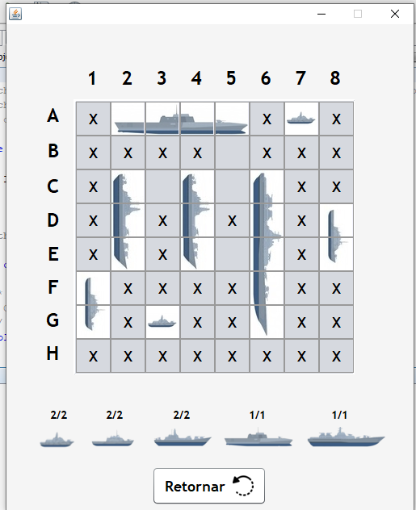
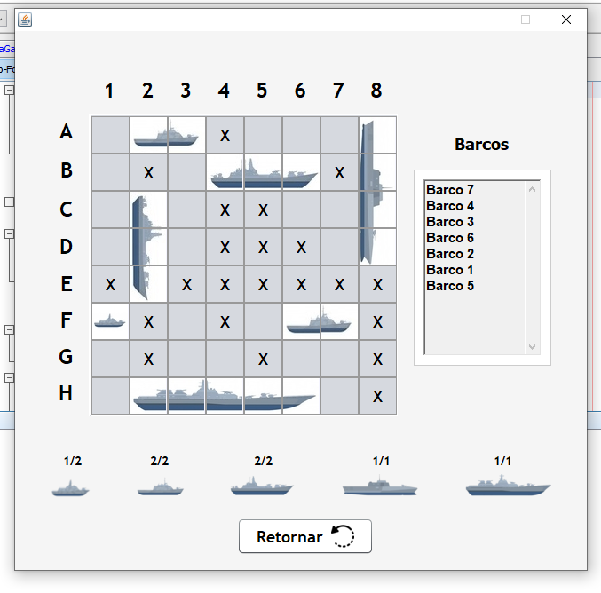

# BattleShip Game
## Simple battleship game developed using Java Programming language
## Information About the game:
 - 8 Ships of sizes from 1 to 5 squares
 - Game finishes when find all ships
 - Game designed for only one player
 - All ships are placed randomly 
 - Version one of the game doesn't contain the name of the ships, whereas version 2 contains it.
 - Version two of the game includes a premium ship, where the player must find it twice to win.

## Software Information:
 - Java Language (JRE 1.8.0)
 
## Images of the game:
<h3 align="center"> Game version 1 </h3>
  
 
    
  

  

<h3 align="center"> Game version 2 </h3>
  
 
    
  

#### OBS: The ships images used on the game was obtained from this [link](https://br.freepik.com/vetores-premium/pacote-de-coleta-de-navio-de-guerra-com-varios-modelos-e-tamanho-com-estilo-moderno_4574281.htm#page=2&query=destruidor&position=18) and this [link](https://www.google.com/search?q=battle+ship+cartoon&tbm=isch&ved=2ahUKEwiQ08mOk-npAhWWLbkGHaEkCLIQ2-cCegQIABAA&oq=battle+ship+cartoon&gs_lcp=CgNpbWcQAzICCAAyAggAMgYIABAIEB4yBggAEAgQHjIGCAAQCBAeMgYIABAIEB4yBggAEAgQHjIGCAAQChAYMgYIABAKEBgyBggAEAoQGDoECCMQJ1C5AViMDGCkDmgAcAB4AIABywWIAeMRkgEJMy0xLjAuMi4xmAEAoAEBqgELZ3dzLXdpei1pbWc&sclient=img&ei=rW3ZXtDINZbb5OUPocmgkAs&bih=636&biw=1366&client=firefox-b-d#imgrc=-ZhdXqJ9SIxPNM)
